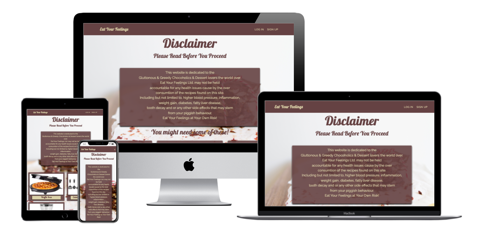
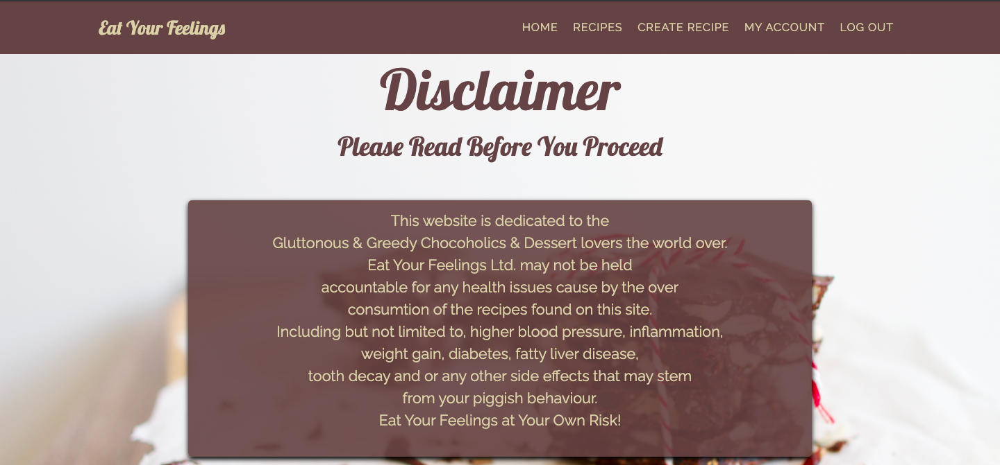
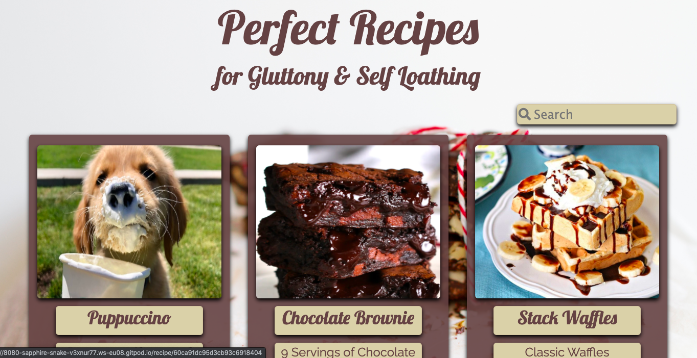
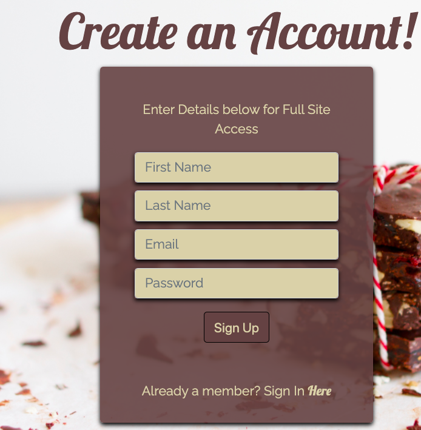
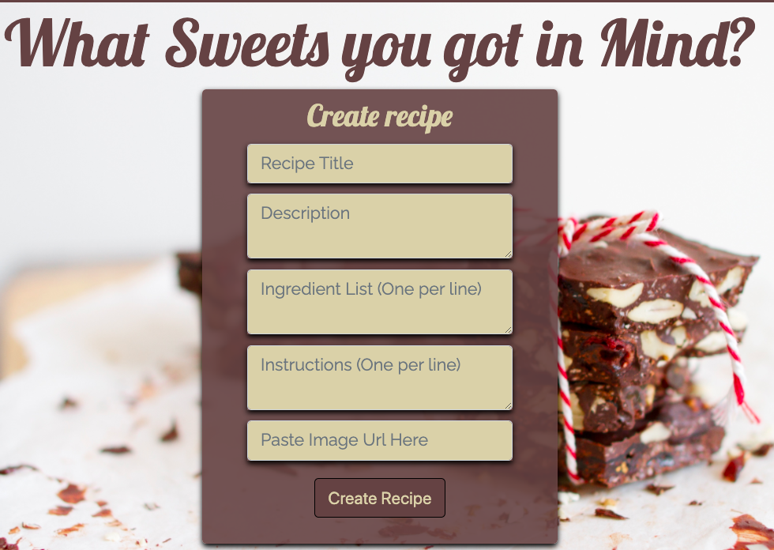
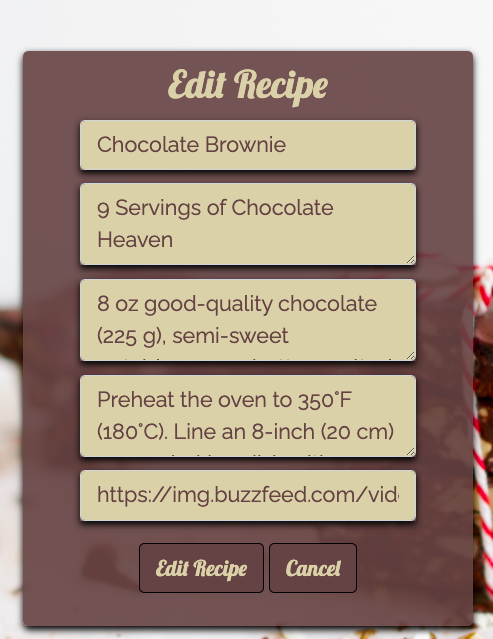

# **MS 3 – Eat Your Feelings**
[Visit Full Site Here](http://eat-your-feelings.herokuapp.com/)

## **Eat Your Feelings Database**

---

This webpage was created to showcase the skills I have learned in the Python Essentials/Backend Development section of the Code Institute Full Stack Web Developer course; this is the third assignment I have completed thus far.
For this project I have chosen to create an online dessert focused cookbook using the MongoDB database, Python, Flask and Jinja.
The aim was to create a website that allows users to create an account, view other account holders recipes and add their own desserts to the database.

---

### **_Table of contents:_**

1. [Description](#eat-your-feelings-database)
2. [UX](#ux)
    1. [The Objective](#the-objective)
    2. [Wireframes](#wireframes)
    3. [Styling](#styling)
    4. [User Stories](#user-stories)
3. [Features](#features)
    1. [Existing Features](#existing-features)
    2. [Features Left to Implement](#features-left-to-implement)
4. [Technology Used](#technology-used)
5. [Testing](#testing)
    1. [Testing User Stories](#testing-user-stories)
    2. [Code Validation](#code-validation)
    3. [Manual Testing](manual-testing)
6. [Deployment](#deployment)
    1. [Remote Deployment](#remote-deployment)
    2. [Local Deployment](#local-deployment)
7. [Credits](#credits)
    1. [Content](#content)
    2. [Media](#media)
    3. [Acknowledgements](#acknowledgements)

---

## **UX**

### **The Objective**

The objective of this website is to create an application that allows lovers of the sweeter things in life to sign up, login, create and edit their own recipes as well as browse the recipes of other users.

This app allows the user to:

- view dessert recipes created by other users
- read the ingredients needed for each recipe
- read the instructions on how to create each recipe
- see which user created each recipe
- see an image of each dessert (if added by the creator)
- Create an account
- login as an existing account holder
- log out of their account
- view their profile page showing the recipes they have created (if any)
- edit recipes they created
- delete recipes they created

### **Wireframes**

Link to Wireframes [here](https://www.figma.com/file/AYkebqGgPDhzMqU1ghJk1a/Eat-Your-Feeling-MS3?node-id=0%3A1) 

#### **Design Differences**

There are alot of differences between the original idea and the final website.

* Firstly more pages were create once I started getting into the making of the app including pages for the Profile, Create/Edit recipe & Error Pages (404, 500, etc) 
* Originally I planned to use the recipes page as my index.html page, however I decided against it as I felt by having them as seperate pages it allowed me to add a 'Disclaimer' explaining the purpose of the website and an area to advertise products a visitor of the site might like to purchase.
* I replaced the 'by' tag under the title of the recipes on the recipes page with a description box allowing the creator to highlight something about the recipe.
* I moved the 'by' tag to the recipe page under the image provided so people can see who made it.
* I removed the 'total, prep,' times and moved the ingredients under the image on the recipe page to let the content hug the edges of the box as I felt it looked more aesthically pleasing and worked better for responsiveness of the app.

### **Styling**

#### *Framework*
Bootstrap 5 has been used to form the structural layout of this website.

#### *Fonts*
The Google fonts Lobster and raleway have been used exclusively on the website

#### *Colors*
* There are two main colors used throughout the website:
    
    
    *   #D9CFAC has been used for the Text & Boxes
    *   #614444 has been used for the Nav, Footer, Text, and Containers
    *   #f3da7e was used for focus and active clicks on buttons and anchor tags

### **User Stories**

* **First Time Visitor Goals**

    * *As a First Time Visitor*, I want to be able to navigate the website simply and easily.
    * *As a First Time Visitor*, I want to access the site across all devices.
    * *As a First Time Visitor*, I want to see other users creations.
    * *As a First Time Visitor*, I want a way to search other users creations.
    * *As a First Time Visitor*, I want to be able to sign up as a user.
    * *As a First Time Visitor*, I want to add my own creations.
    * *As a First Time Visitor*, I want a page where I can see my own creations.

* **Returning Visitor Goals**

    * *As a Returning Visitor*, I want to be able to inspect and edit my own creations.
    * *As a Returning Visitor*, I want other to view my creations but not edit them.
    * *As a Returning Visitor*, I want to easily navigate to the log in page to view my profile
    * *As a Returning Visitor*, I want to view all of the recipes I have added to the site
    * *As a Returning Visitor*, I want to be able to delete any of my own creations I no longer want.
    * *As a Returning Visitor*, I want to be able to log out of the site.

---

## **Features**

* The Project is a multi-page website which uses a MongoDB database and Flask/Jinja/Python template management.

    1. The Index page consists of a Nav section and footer section that feature on every page. It also includes a disclaimer, telling the visitor abit about the website and provides links to products they might like to buy.
        
           
    
    2. The recipes page displays the full database of desserts that users have created. Each recipe has its own card with an image of the dessert, it's name and descrption about the recipe. The title and image on all recipes work as links to the recipe page for that particular dessert. 
    
    
    3. The Login and Sign Up sections take the user to the related page, allowing the customer to either login or sign up. The pages have links to each other in case the customer has click the wrong one.
    
    
    
    4. The create recipe page has a form which allows the user to add a recipe to the database.
    

    5. The recipe page has a container displaying the image, ingredients and instructions to creating the recipe. It also includes an edit and delete button at the bottom.
    

    6. The edit recipe page has a form which allows the user to update the recipe in database.
    
    
    7. The profile section shows the user their own creations which they can edit or delete if they wish.
    
    
    8. The log out button logs the user out and returns them to the login page.
    

    9. I also include custom 404, 405 & 500 error pages incase the app is to ever crash.
    ! [404](static/readme-assets/fourohfour.png)
    ! [405](static/readme-assets/fourohfive.png)
    ! [500](static/readme-assets/fiveohfive.png)

### **Existing Features**

*	The site has been designed to be responsive across all devices

*	The navbar remains on every page, allowing easy navigation at all times, It give the user the ability to move to the home page, view recipes, create recipes, my account page and to log out.
*	The navbar is styled differently for different screen sizes, changing from a three line “hamburger” dropdown nav on tablet and smaller to a traditional full screen navbar on larger screens
*	The user has the ability to sign up and/or login using the relative areas
*	The user can view all creations in the database
*   The user can search through all of the created recipes by title using the search bar.
*	The user has the ability to create, edit or remove any creation of their own making.
*	The footer displays a link to the github repository.

### **Features Left to Implement**

* A 'like' or grading feature that allows user to rate other desserts
* The ability for the user to change password
* A 'Favourite section showing the users favourites desserts. 
* Some defensive programing to ask a user if they are sure that they want to delete a recipe after pressing the delete button
* A comment section under the recipe page to give thoughts on the dessert
* Icons to symbolize the potential dangerous ingredients in the dessert (nuts, eggs, etc)

---

## **Technologies Used**

All of the following technologies were used to create this website:-

### **Languages**

*	**HTML5**

*   **CSS3** 
*	**JavaScript**

    have been used throughout the project to create the text, style and functionality of the website.

*	[Python](https://www.python.org/) has been used to run the application

### **Frameworks and Libraries**

*	[MongoDB](https://www.mongodb.com/) has been used to to store the database
*	[Flask](https://flask.palletsprojects.com/en/1.1.x/) has been used to to dynamically generate pages, links, and content within the app
*	[PyMongo](https://pypi.org/project/pymongo/) has been used to connect to and transfer data to MongoDB
*	[Jinja](https://jinja.palletsprojects.com/en/2.11.x/) has been used to template the website
*	[Bootstrap]( https://getbootstrap.com/) was used for layout aesthetics, including grid styling and device responsiveness
*	[GitHub]( https://github.com/) was used to host the website
*	[Gitpod]( https://www.gitpod.io/) was used to code the website

### **Software and Resources**

*	[FontAwesome](https://fontawesome.com/) was used to add icon on footer and collapse navbar
*	[Figma]( https://www.figma.com) was used to create the wireframes of the project
*   [Techsini](https://techsini.com/multi-mockup/) was used to style the multi screen mockup

## **Testing**

### **Testing User Stories from the UX Section**

**First Time Visitor Goals**

* *As a First Time Visitor*, I want to be able to navigate the website simply and easily.
    *   On opening the website the visitor is met with the Disclaimer detailing what the page is about, the log in and sign up button and clearly visible in the top right corner. After login in or signing up the user has full access to the web app.

* *As a First Time Visitor*, I want to access the site across all devices.
    *	The website is responsive across all devices
    
* *As a First Time Visitor*, I want to see other users creations.
    *	The nav has a recipes button that links to a page that show all of the desserts in the database.

* *As a First Time Visitor*, I want a way to search other users creations.
    *	The recipes page has a prominent search bar that allows the user to search through the recipes by title.

* *As a First Time Visitor*, I want to be able to sign up as a user.
    *   There is a sign up link in the nav and also a button under the callout guiding the user to the sign up page.
    *   The user only need to provide first and last name, an email and password to sign up.

* *As a First Time Visitor*, I want to add my own creations.
    *   Any member can create a recipe to the database via the 'create recipe' page.
    *   The user can add any type of dessert they wish and can add an image if they wish. If they dont one is added for them automatically.

* *As a First Time Visitor*, I want a page where I can see my own creations.
    *   A signed in user can view all of their own recipe creations on their profile page.

**Returning Visitor Goals**

* *As a Returning Visitor*, I want to be able to inspect and edit my own creations.
    *   On the profile page, the user can edit or remove any of their own creation if they so choose.
    *   The user can also edit or remove their recipe after clicking on it on the recipes page.

* *As a Returning Visitor*, I want other users to view my creations but not edit them.
    *	Users can view any recipe in the database via the recipes page and see them in more detail after clicking on them.
    *   No user can edit or delete another users recipe

* *As a Returning Visitor*, I want to easily navigate to the log in page to view my profile
    *	The fixed nav has a link to the login page
    *   Once logged in a user is directed to their profile page

* *As a Returning Visitor*, I want to view all of the recipes I have added to the site
    *   The users profile page displays a collection of all of their own recipes

* *As a Returning Visitor*, I want to be able to delete any of my own creations.
    *   The user can edit or delete any of their own recipes at any point as long as they are signed in
    *   Users can only edit or delete recipes that they have created.

* *As a Returning Visitor*, I want to be able to log out of the site.
    *   There is a log out button on the fixed nav that can be used on any page of the site.

### **Code Validation**

#### *W3 Validators*

*    The HTML was Validated at [W3C Markup Validation Service](https://validator.w3.org/). 

*    The CSS was Validated at [W3C CSS Validation Service](http://jigsaw.w3.org/css-validator/).

*   The Python was Validated at [pep8online](http://pep8online.com/)

### **Manual Testing**

#### *Google Developer Tools*

   * The websites design responsiveness has been tested on all device sizes using Google Developer Tools.

#### *Testing On Mobile Devices*
   *    Apple iOS
   *    OnePlus 8T
 
#### *Testing On Browsers*
   *    Google Chrome
   *    Safari
   *    Firefox

    
#### *Testing On Operating Systems*
   *    Apple Mac OS
   *    One Plus

### **Defensive Design Testing**

#### Index page

*   Test all links and buttons on Index page:
    *   All Navbar buttons link to the page expected
    *   All footer links to social media function as expected
    *   Links to the different cooking utensils function as expected

#### Recipes page

*   Test all links to different recipes:
    *   All recipes link to specific recipe page
    *   Recipes organised by most recently added
    *   Replacement image generates if no image is added by recipe creator

#### Recipe page

*   Test link to edit recipe:
    *   All info from Mongdb displays upon entering this page
    *   Link to edit recipe page functions as expected

#### Sign Up page

*   Test Sign Up form:
    *   User cannot create an account without entering an email address
    *   Email Address must have an @ symbol
    *   If any of these points fail a message appears informing the user what is needed
    *   The link switching the user from login to sign up at the bottom of the form functions correctly

#### Login page

*   Test Login functionality:
    *   User must enter a correct email address already on the system
    *   User must enter the correlating password already on the system
    *   If either of these points are not achieved a "incorrect/username or password" message flashes
    *   The link switching the user from login to sign up at the bottom of the form functions correctly

#### Profile page

*   
    *   Once signed in the customer recieves a welcome message and their first  name appears anytime they click on the my account page
    *   The create recipe button takes the user to the create recipe form
    *   The edit recipe button takes the user to the edit recipe form
    *   The delete recipe button removes the dessert

#### Create Recipe page

*   Test Create Recipe form works:
    *   A forms must be filled out
    *   The form needs at least one ingredient and one instruction
    *   If no Image url is added or is added incorrectly, a default image is used
    *   Once a recipe is created the user is directed to the recipes page

#### Edit Recipe page

*   Test Edit Recipe Form works:
    *   All original content is placed on the form
    *   Changes can be made to any input as long as the edit complies with the same rule-sets as before
    *   Edit recipe button saves the new information and directs the customer to the recipes page
    *   Cancel makes no changes and directs the user to the recipes page

#### Logout Buttons

*   Test Logout Button:
    *   Pressing the logout button logs out the user and returns them to the login page

    
#### *Issues Found*

*   * An issue arose when adding fixed-top class to navbar. The titles of each page pushed up behind the navbar making them illegible.
        * Resolved by adding a padding-top to the body.

*   * Similar issues arose with the footer as it would float into the middle of the page and cover the main page content.
        * Resolved by setting the footer to fixed-bottom class and adding padding-bottom to the body so it didnt block any of the pages content.

*   * Footer covers some of the pages content when scrolled to the bottom on One Plus 8T mobile device but not on dev tools devices
        * Issue not resolved
---

## **Deployment**

### **Remote Deployment**
1. Navigate to the GitHub [Repository:](https://github.com/PodgeCollins/EatYourFeelings_MS3)
2. Open [repository](https://github.com/PodgeCollins/EatYourFeelings_MS3) using [GitPod](https://www.gitpod.io/) IDE.
3. In terminal run "pip3 freeze --local > requirements.txt" command to create a .txt file with all of the dependencies used that [Heroku](https://www.heroku.com) needs to know what dependencies app uses.
4. In the terminal run the "echo web: python app.py > Procfile" command to create Procfile that [Heroku](https://www.heroku.com) needs to know what file runs the app.
5. Go to [Heroku](https://www.heroku.com) and log in.
6. Once logged in, and in your dashboard, click on "Create New App".
7. Under "Create New App" click on the input field called "App Name".
8. Give your app a unique name and select the closest region to your location.
9. Click "Create App"
10. In the "Deployment Method" section, connect the app by clicking on the "Github" icon.
11. Type the Github repo-name in the "Connect to Github" section input.
12. Click "search" to find the repo and once it is found click "connect".
13. Before clicking the "Enable Automatic Deployment" button, click on the settings tab in the top part of the page.
14. Click on "Reveal Config Var".
15. Here you can inform Heroku of which variables will be required.
16. The required variables are: (IP, PORT, MONGO_URI, MONGODB_NAME, SECRET_KEY).
17. Go back to [GitPod](https://www.gitpod.io/) and make sure that you have pushed your requirements.txt and Procfile to the repo.
18. Return to Heroku and click on "Enable Automatic Deployment".
19. Select your branch. Branch selected (master).
20. Click "Deploy Branch"
21. Once deployment is finished click "View" to launch the new app.

### **Local Deployment**
1. Navigate to the GitHub [Repository:](https://github.com/PodgeCollins/EatYourFeelings_MS3)
2. Click the **Code** drop down menu.
3. Download the ZIP file and unpack locally
4. Open a code editor of your choice and open the unzipped file using the code editor.
5. Click **Save** and save to your local device
6. In order to have a functional app, you will have to create your own MongoDB collection and inserted your "MONGO_URI" and not the one used in the project.

---

## **Credits**

### **Content**

*	My code was influenced by Backend Development Mini Project lessons from the [Code Institute](https://courses.codeinstitute.net/login) Full Stack Developer Course.

### **Media**

*  The default image displayed was obtained from [Clipartkey](https://www.clipartkey.com)

### **Acknowledgements**

*   I received advice for improving my search bar code from my Code Institute mentor **Oluwafemi Medale**

*   Additional help to put font awesome icon in search bar from [StackOverflow]    (https://stackoverflow.com/questions/19350291/use-font-awesome-icon-in-placeholder)

*   Additional help to test Error Pages from [Youtube](https://www.youtube.com/watch?v=2TUaf-Jp5kw&ab_channel=PrettyPrinted)

*	I received styling inspiration from:

    *   [BBCGoodFood](https://www.bbcgoodfood.com) 
    
*   Additional Thanks to my mentor **Oluwafemi Medale** for styling and formatting advice.